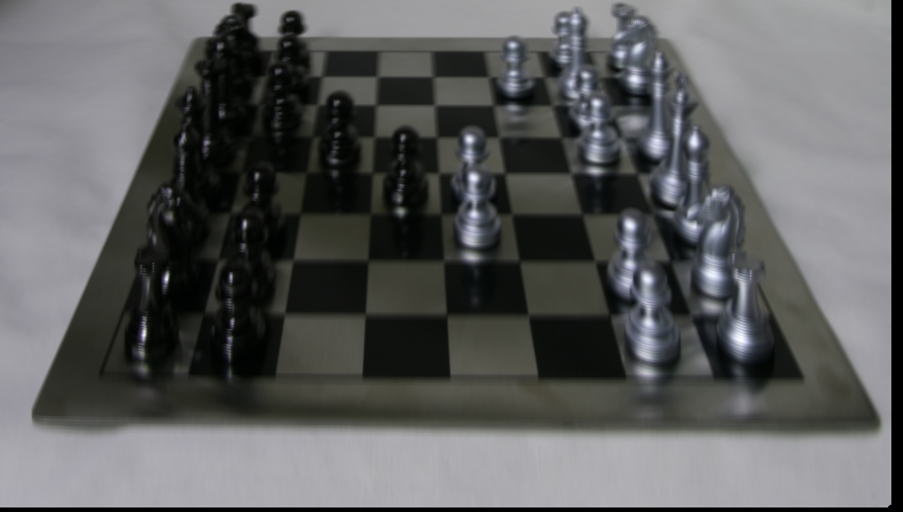

# CSE168-Lightfield-Viewer
This is a novel lightfield Viewer created using the OpenGL engine.
It is created to read in and load lightfield data pulled from the new Stanford Lightfield Archive.
The source files submitted have a few of the lightfield datasets, contained in the data folder, but this program
should work with any of the data sets pulled from this website: http://lightfield.stanford.edu/lfs.html. 
Once loaded, you can use the arrow keys to change the aperture size and focus, as well as clicking and dragging
the mouse to change the camera position.

Along with using the OpenGL library, it also uses the open source stb_image library in order to load in images as data.

This program was created in Visual Studio, so while other compilation methods may work,
I personally compiled and ran using VS.

This program takes in up to 2 command line arguments, with one of them being required. The 1st argument is the
relative path to the folder containing the light field data. For example, 'data/legos' would be a valid folder.
The 2nd optional argument is a flag for how much of the data you want loaded in. '-f' for the full dataset,
'-m' for a medium dataset (9x9), or '-s' for a small dataset (5x5). While the full dataset looks the most accurate and has the
least artifacting, it can take a while to load. By default, the full dataset is used if no flag is specified.

You can see examples of the results this Lightfield Viewer achieves below.

Default view of the chessboard. Can see the depth of field effects from the focus being on the back chess pieces instead of the foreground ones.

View of the chessboard from a different angle. You can see the depth of field changes, and the reflections of the pieces remain consistent despite the modified camera position.

View of the lego set, with the focus being the lego in the center.

This time, the view is focused on the legos in the foreground. You can see the foreground elements pop out more, while the background elements look blurry and unclear.

The same lego view, but with a very tiny aperture size. You can see at very small aperture sizes, the image appears much more crisp, with everything in focus, but with less
depth to the image.

With the attached datasets and potentially additional datasets from the Stanford archives or otherwise, you can achieve a variety of different graphical effects.

This program works by first reading in all files from a given folder, and extracting the camera view information from the file names (row, column, camera position). 
Then, using OpenGL, it loads in and appends all of the images into a large tiled image. This image data is saved as a 3D texture, where the width and height
are the width and height of the original image, and the depth is the number of images in the dataset. This essentially creates an array of images, where given texture coordinates (s,t,r), s & t refer to the position on the camera view, while r refers to the index of the camera view being referenced.
Using that 3D texture, we pass it along with the aperture size, focus, and camera location (x, y position bounded between 0.0 to 1.0) to the shaders, which then use that
to calculate the color of each fragment according to the camera view slices.
Doing all of the heavy calculations in the shader files lets us change values and see the viewer render in real time, giving us our complete Lightfield Viewer.

Creating this lightfield viewer was a very interesting experience. Seeing the various visual effects I could create from synthesizing a bunch of camera views together was very impressive once it was completed.
While this viewer of course isn't as state-of-the-art as other viewers, I would love to test this with much more complex datasets with more complex reflections and geometry to see where I could improve. There is definitely more I could've done, especially in handling file compression and memory. The datasets could be compressed to be smaller, and there could have been possibly different approaches to handling the data that would have reduced memory usage. 
